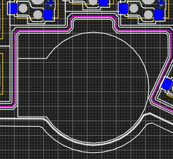
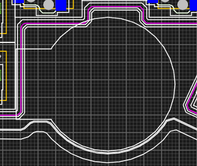
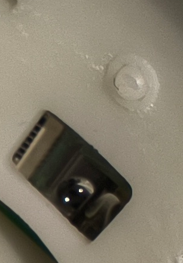

# トラックボール

親指操作用の34mmトラックボールを配置できます。 [サンプル](../sample/34key-split-col-staggerd-dual-trackball.json)

## 追加で必要な部品

下記は片手分です。両側にトラックボールを配置する場合は2セット必要です。

|部品|数|備考|
|-|-|-|
|トラックボール(34mm)|1|センサーは赤LEDなので、赤系統が反応しやすいです|
|2mmセラミックボール|3|支持球用|
|14mmマウス|1|https://nogikes.booth.pm/items/6520217|
|FFCケーブル(0.5mmピッチ, 6ピン, 同一面)|1|長さはトラックボールからコントローラまでのマンハッタン距離+50mm くらいあれば十分だと思います。|

## 組み立てに必要な道具

|名前|使い道|
|-|-|
|木工用ボンド|支持球の固定|
|マスキングテープ|支持球を接着するときの養生、センサー取付部の調整|
|爪楊枝|木工用ボンドを塗る|

## トラックボールの有効化

`Matrix Editor`で`Trackball`にチェックを入れるとトラックボールが配置されます。
無線版コントローラではトラックボールを配置すると使用可能なピン数が14本に減ります。

## レイアウトの指定

`Placement Editor`でボールの位置と角度を指定します。
`PCB Editor`でみたときにトラックボールを示す枠線が他の枠線と交差しないようにしてください。

|||
|-|-|
|OK|NG|

## データの出力

データを出力するとトラックボールが配置されたケースデータとファームウェアが出力されます。
ファームウェアはトラックボールを使用するための最低限の設定しか書いていないので、必要に応じて編集してください。

## 組み立て

### キースイッチの取り付け

* まずは通常の組み立て手順にしたがい、キー入力が可能になるところまで組み立ててください。
* 無線版コントローラの場合はバッテリーの取り付けは不要です。組み立て中にショートさせたりする危険があるので、必ず外してください。
* 動作確認の手順までUSBケーブルも外してください。

### 支持球の固定
  
* 爪楊枝の先端に木工用ボンドを少しだけとり、取り付け位置に少量塗ります。
* マスキングテープに支持球を貼り付け、そのまま取り付け位置に貼り付けます。
* 木工用ボンドが乾いたらマスキングテープを外します。

### ボトムケースを外す

* 組み立てるためにボトムケースを外してください。

### センサーの動作確認

* センサーとコントローラをFFCケーブルで接続します。
* コントローラにUSBケーブルを差し込み、センサーを机の上で動かして動作確認します。
* 動作確認が終わったらUSBケーブルを外してください。

### センサーの固定・調整

* FFCケーブルを折り曲げながらセンサーを固定部に挿入します。
  * 固定部の隙間が広すぎる場合はマスキングテープなどで狭めてください。

### 動作確認

* 34mm球を押し込み、USBケーブルを差し込んで動作確認します。
* うまく動かない場合はセンサーの位置を調整してください。

### ボトムケースを取り付ける

* 無事に動いたらケースを閉じてください
